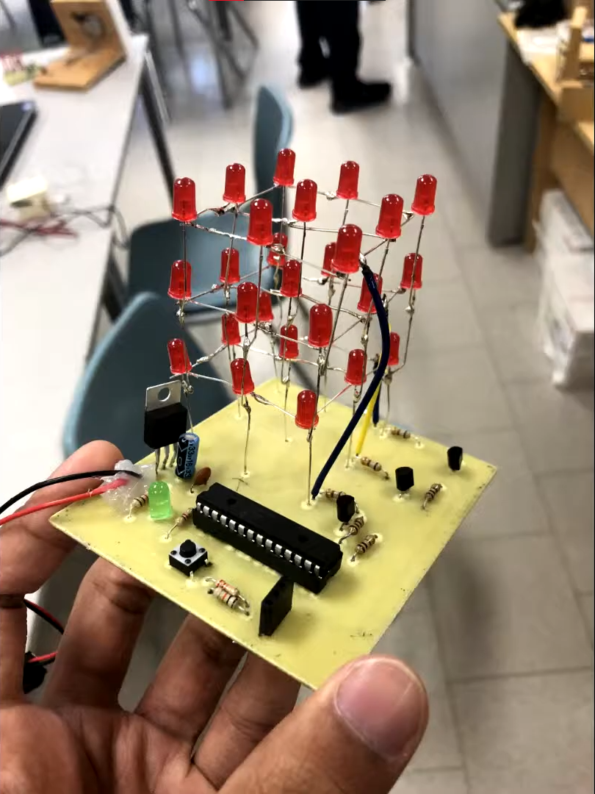
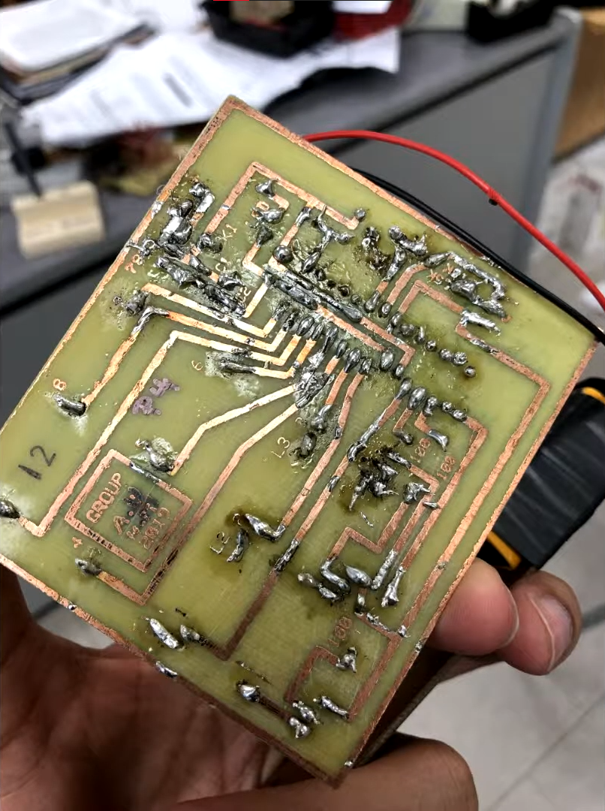
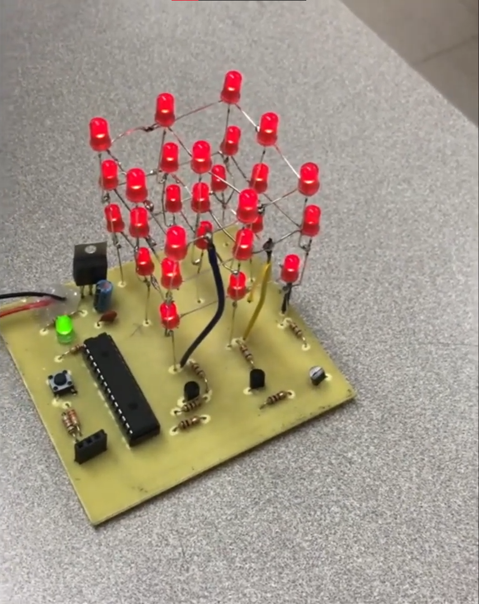

# ledCube

Components Used:

-1x 20x2 PICAXE chip
-3x 100Ω Resistor
-3x 680Ω Resistor
-1x 1kΩ Resistor
-1x 4.7kΩ Resistor 
-1x 10kΩ Resistor
-1x 22kΩ Resistor
-27x 3mm Red LED
-1x 3mm Green LED
-2x Capacitor
-4x Transistor
-1x Push Button
-Jumper cables

## Demo Video
https://www.youtube.com/watch?v=epSIzQugRj4&ab_channel=AyanUsmani

## Images

